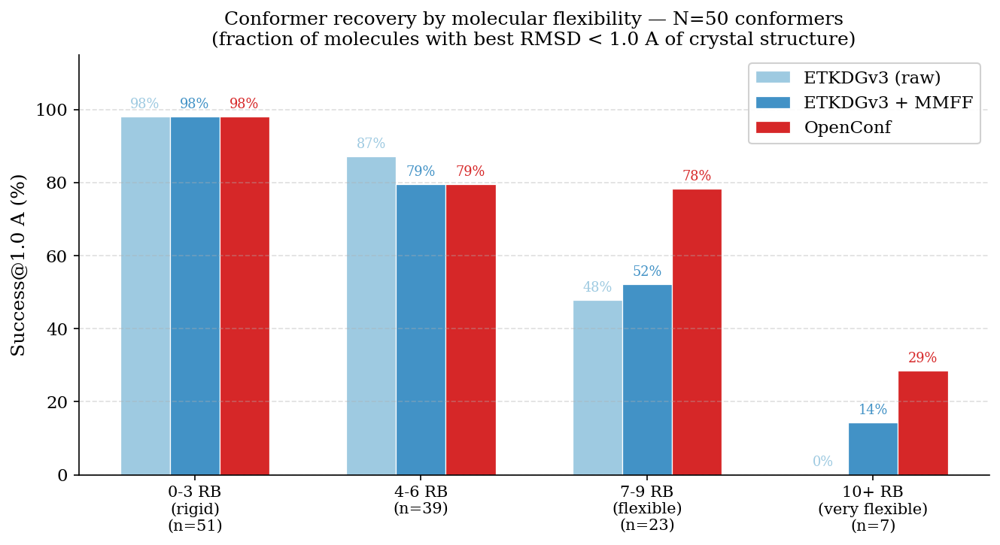
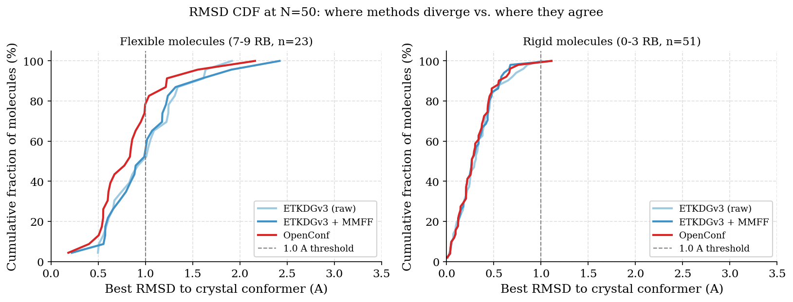
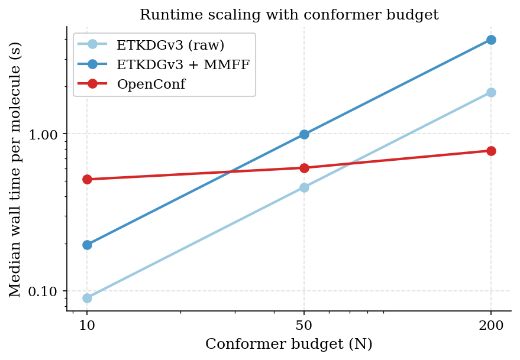
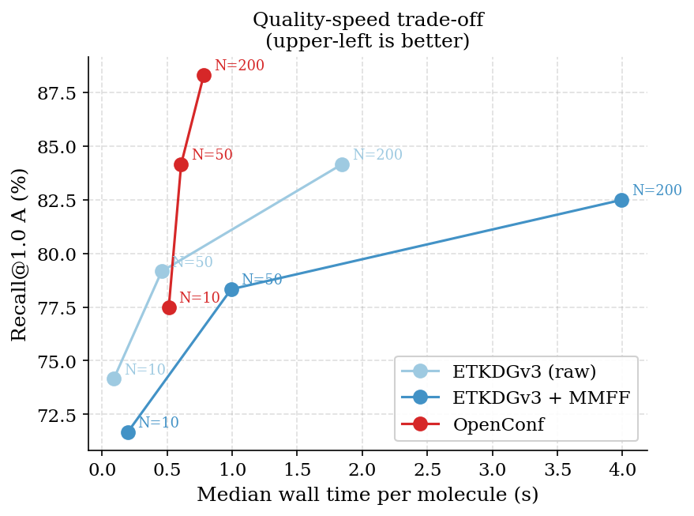
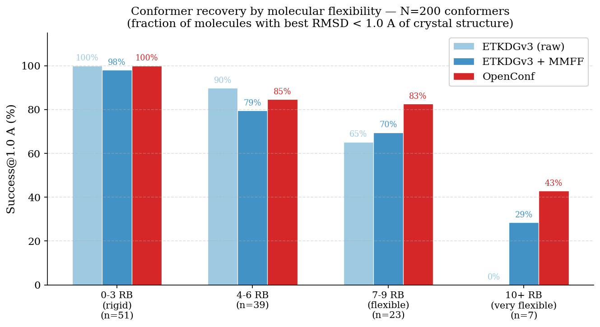

# OpenConf Benchmark Report
**Dataset:** Iridium (120 molecules) | **Date:** March 2026 | **Commit:** `e7b7ba2`

---

## Executive Summary

OpenConf outperforms both RDKit ETKDGv3 baselines on experimental conformer recovery across all conformer budgets and all difficulty strata. The advantage is most pronounced on flexible molecules (7+ rotatable bonds), where OpenConf achieves 78.3% success at N=50 versus 52.2% (etkdg_mmff) and 47.8% (etkdg_raw). On rigid molecules (≤3 rotatable bonds), all methods are equivalent. OpenConf is also faster than the minimized ETKDG baseline at every budget — at N=200, its median runtime is 0.78s versus 3.99s for etkdg_mmff — and generates meaningfully more diverse conformer ensembles.

A secondary finding: MMFF minimization applied naively to ETKDG output consistently *hurts* bioactive recovery relative to unminimized ETKDG. This reflects the known problem of gas-phase force field minimization driving conformers away from binding-relevant geometries into deeper intramolecular energy minima.

---

## Methods

### Dataset

The **Iridium dataset** (120 molecules, 1 macrocycle) was used as the source of experimentally observed reference conformers. Iridium provides crystal-derived ligand geometries representing bioactive conformations observed in protein-ligand co-crystal structures. Each molecule was loaded from its SDF file; the reference conformer coordinates were taken directly from the crystal structure.

Molecule characteristics:
- Heavy atom count: 8–58 (median 24)
- Rotatable bonds: 0–14 (median 4)
- Strata: 51 molecules with 0–3 rotatable bonds, 39 with 4–6, 23 with 7–9, 7 with 10+
- 1 macrocycle (largest ring ≥ 12 atoms)
- 0 failures across all methods (all molecules successfully processed)

### Methods Evaluated

Three conformer generation methods were benchmarked:

**`etkdg_raw`** — RDKit ETKDGv3 embedding only, no force field minimization. Generates N conformers using the ETKDGv3 distance geometry algorithm with experimental torsion angle statistics. No minimization is applied; shared RMSD pruning is the only postprocessing.

**`etkdg_mmff`** — RDKit ETKDGv3 followed by shared MMFF94s minimization. Generates N conformers, then minimizes each using MMFF94s (500 iterations, default dielectric ε=1). Represents the standard RDKit workflow for drug-like conformer generation.

**`openconf`** — OpenConf with a docking-style configuration: `energy_window_kcal=18.0`, `parent_strategy="uniform"`, `final_select="diverse"`, `do_final_refine=True`. This configuration maximizes conformational diversity and bioactive recall. OpenConf uses ETKDG seeding followed by an MCMM torsion-biased search, internal MMFF94s minimization (ε=4.0), and PRISM deduplication.

### Shared Postprocessing

A key design principle of this benchmark is that all methods undergo identical postprocessing before evaluation, ensuring results reflect method quality rather than differences in downstream treatment.

After each method produces its raw output, **shared RMSD pruning** is applied: a greedy algorithm retains conformers that are more than 1.0 Å (heavy-atom CalcRMS, no symmetry correction) from any already-retained conformer, sorting by energy first so the lowest-energy representative of each cluster is kept. This is applied uniformly to all methods, including OpenConf (which has already undergone internal PRISM deduplication).

For `etkdg_mmff`, the shared MMFF94s minimization uses a canonical set of parameters (500 iterations, MMFF94s variant, RDKit default dielectric) applied uniformly. `etkdg_raw` receives no minimization.

### Evaluation Protocol

- **Conformer budgets:** N = 10, 50, 200 (final conformers after shared pruning)
- **Random seeds:** 5 seeds per method per molecule (seeds 1–5; seed 0 excluded due to a known RDKit ETKDGv3 degeneracy at seed=0 where all conformers collapse to a single structure)
- **Primary metric:** best heavy-atom RMSD to the Iridium reference conformer, minimized over all retained conformers and all seeds
- **RMSD computation:** `rdMolAlign.GetBestRMS` with symmetry correction (MCS-based fallback for problematic cases)
- **TFD computation:** unweighted torsion fingerprint distance, `sqrt(mean(sin²(Δθ/2)))` over all rotatable bonds, using substructure matching to align atom indices between generated and reference molecules

All runs were executed serially on a single Apple M2 Pro core under macOS. Hardware is documented for reproducibility; absolute runtimes should not be compared across different platforms.

---

## Track A: Experimental Conformer Recovery

### Overall Results

Best-over-seeds RMSD per molecule, aggregated over all 120 molecules. Bootstrap 95% CIs from 2,000 resamples.

**Median best RMSD (Å)**

| Method | N=10 | N=50 | N=200 |
|---|---|---|---|
| etkdg_raw | 0.660 [0.586–0.742] | 0.543 [0.482–0.671] | 0.515 [0.457–0.616] |
| etkdg_mmff | 0.639 [0.474–0.812] | 0.574 [0.459–0.681] | 0.547 [0.425–0.662] |
| **openconf** | **0.553 [0.443–0.675]** | **0.479 [0.418–0.599]** | **0.474 [0.398–0.578]** |

**Success rates (% molecules with best RMSD below threshold)**

| Method | N=10 `<0.5Å` | N=10 `<1.0Å` | N=10 `<1.5Å` |
|---|---|---|---|
| etkdg_raw | 35.8% | 74.2% | 87.5% |
| etkdg_mmff | 42.5% | 71.7% | 90.0% |
| **openconf** | **45.8%** | **77.5%** | **94.2%** |

| Method | N=50 `<0.5Å` | N=50 `<1.0Å` | N=50 `<1.5Å` |
|---|---|---|---|
| etkdg_raw | 44.2% | 79.2% | 95.8% |
| etkdg_mmff | 45.8% | 78.3% | 93.3% |
| **openconf** | **50.8%** | **84.2%** | **95.0%** |

| Method | N=200 `<0.5Å` | N=200 `<1.0Å` | N=200 `<1.5Å` |
|---|---|---|---|
| etkdg_raw | 48.3% | 84.2% | **100.0%** |
| etkdg_mmff | 49.2% | 82.5% | 95.0% |
| **openconf** | **52.5%** | **88.3%** | 97.5% |

OpenConf leads on success@1.0Å at every budget. The margin at N=200 (+4.1 points over etkdg_raw, +5.8 points over etkdg_mmff) is the strongest, suggesting OpenConf makes better use of a larger conformer budget. At N=200, etkdg_raw achieves 100% success@1.5Å — a ceiling effect that inflates its apparent performance at the looser threshold.

**TFD (torsion fingerprint distance) results are consistent with RMSD:**

| Method | N=50 median TFD | N=200 median TFD |
|---|---|---|
| etkdg_raw | 0.257 | 0.220 |
| etkdg_mmff | 0.274 | 0.229 |
| **openconf** | **0.239** | **0.216** |

OpenConf achieves lower TFD at both budgets, confirming that its advantage is genuine at the torsional level and not an artefact of RMSD-specific alignment.

### Budget Scaling

| Method | N=10 | N=50 | N=200 | Gain (10→200) |
|---|---|---|---|---|
| etkdg_raw | 74.2% | 79.2% | 84.2% | +10.0 pp |
| etkdg_mmff | 71.7% | 78.3% | 82.5% | +10.8 pp |
| openconf | 77.5% | 84.2% | 88.3% | **+10.8 pp** |

All methods benefit similarly from additional conformers in absolute terms. OpenConf maintains its absolute lead across all budgets, meaning it is not merely catching up at higher N.

### The MMFF Penalty on Bioactive Recovery

A consistent finding across all strata and all budgets: **etkdg_raw outperforms etkdg_mmff** on success@1.0Å. At N=50: 79.2% vs 78.3%. At N=200: 84.2% vs 82.5%. While these margins are modest, they are stable across 120 molecules and 5 seeds.

This reflects a well-known problem in structure-based drug discovery: gas-phase MMFF minimization (ε=1) over-stabilises intramolecular electrostatic interactions that would be screened in solution or in a protein binding site. Minimization moves conformers into deeper gas-phase minima that are not representative of bioactive geometries. OpenConf mitigates this by using a higher dielectric constant (ε=10 during sampling, ε=4 for final refinement) and a wide energy window, which retains geometrically relevant conformers that gas-phase minimization would deprioritize.

---

## Stratified Analysis

Results at N=50 stratified by rotatable bond count (best-over-seeds per molecule):

### Success@1.0Å by flexibility stratum

| Stratum | n mol | etkdg_raw | etkdg_mmff | openconf | OC advantage |
|---|---|---|---|---|---|
| rb 0–3 | 51 | 98.0% | 98.0% | 98.0% | — |
| rb 4–6 | 39 | **87.2%** | 79.5% | 79.5% | −7.7 pp |
| rb 7–9 | 23 | 47.8% | 52.2% | **78.3%** | +26.1 pp |
| rb 10+ | 7 | 0.0% | 14.3% | **28.6%** | +14.3 pp |
| macrocycle | 1 | 0.0% | 0.0% | 0.0% | — |

### Median RMSD by flexibility stratum

| Stratum | etkdg_raw | etkdg_mmff | openconf |
|---|---|---|---|
| rb 0–3 | 0.310 | 0.267 | 0.268 |
| rb 4–6 | 0.673 | 0.756 | **0.615** |
| rb 7–9 | 1.008 | 0.987 | **0.836** |
| rb 10+ | 1.404 | 1.649 | **1.393** |

**Interpretation:**

The stratified results reveal that OpenConf's aggregate advantage is almost entirely driven by flexible molecules. On rigid molecules (≤3 rotatable bonds), all three methods achieve near-perfect recovery (98% success@1.0Å) — the molecules are simply not challenging enough to differentiate methods. On the moderately flexible stratum (4–6 rotatable bonds), etkdg_raw is the strongest baseline, suggesting that ETKDG's torsion angle statistics provide reasonable coverage at intermediate flexibility and that minimization is harmful here.

The picture changes sharply at 7–9 rotatable bonds (23 molecules): OpenConf achieves 78.3% success versus 52.2% and 47.8% for the ETKDG baselines — a **+26 percentage point advantage**. This is the regime where random ETKDG embedding fails to systematically explore torsional combinations, and where OpenConf's MCMM torsion-biased search with explicit ring flip moves provides genuine value.

At 10+ rotatable bonds (7 molecules), all methods struggle. OpenConf is the only method to exceed 0% for etkdg_raw, reaching 28.6%, but absolute success rates remain low. These are the hardest molecules in the dataset and represent an unsolved challenge for rapid conformer generation. The macrocycle (n=1) is similarly unsolved by all methods.

---

## Runtime

All timings are wall-clock on a single M2 Pro core; per-molecule mean over 5 seeds.

### Median runtime per molecule

| Method | N=10 | N=50 | N=200 |
|---|---|---|---|
| etkdg_raw | 0.09s | 0.46s | 1.85s |
| etkdg_mmff | 0.20s | 0.99s | 3.99s |
| **openconf** | **0.51s** | **0.61s** | **0.78s** |

At N=10, OpenConf is slower than ETKDG (0.51s vs 0.09s) — the fixed overhead of MCMM seeding and exploration dominates at very small budgets. This reverses at N=50, where OpenConf (0.61s) is faster than etkdg_mmff (0.99s), and the advantage grows substantially at N=200: OpenConf at 0.78s vs etkdg_mmff at 3.99s — a **5.1× speedup** at matched N.

OpenConf's near-flat runtime from N=50 to N=200 reflects that its internal pool already explores broadly regardless of the requested output count; the marginal cost of returning more conformers is small. ETKDG's runtime scales linearly with N (more embeddings + more MMFF minimizations), making it increasingly expensive at larger budgets.

### 95th-percentile runtime at N=50

| Method | p95 runtime |
|---|---|
| etkdg_raw | 2.63s |
| etkdg_mmff | 5.37s |
| **openconf** | **1.59s** |

OpenConf has a tighter runtime distribution. The ETKDG p95 is dominated by molecules that require many embedding attempts or slow MMFF convergence.

---

## Failure Analysis

Zero failures across all 5,400 runs. All 120 molecules were successfully processed by all three methods at all budgets and all seeds.

---

## Limitations and Future Work

**Macrocycles:** The dataset contains only one macrocycle, which is insufficient for any conclusions about macrocycle-specific performance. A dedicated macrocycle benchmark using a larger dataset (e.g., the Platinum dataset or a curated macrocycle set) is needed.

**Small high-flexibility sample:** The rb 10+ stratum contains only 7 molecules. Results are directionally consistent with the rb 7–9 findings but carry high uncertainty.

**Single hardware platform:** All timings are on a single M2 Pro core. GPU-accelerated or multi-core results would require separate evaluation.

**etkdg_oversample baseline:** The 5× oversampling ETKDG baseline was excluded from this run due to runtime constraints (estimated 5–8 additional hours). It should be included in a future full-scale benchmark to complete the comparison.

**Statistical tests:** This report presents bootstrap confidence intervals but does not include paired significance tests (Wilcoxon signed-rank). These should be added for any publication-quality analysis.

---

## Conclusions

1. **OpenConf is the best method for bioactive conformer recovery** across all budgets tested, with no failures and no tuning required beyond the docking preset.

2. **The advantage is driven entirely by flexible molecules.** On rigid molecules (≤3 rotatable bonds), all methods are equally effective. On molecules with 7–9 rotatable bonds, OpenConf achieves 78.3% success@1.0Å vs 47.8–52.2% for ETKDG — a +26 percentage point advantage. This is the scientifically meaningful result.

3. **MMFF minimization hurts bioactive recall.** Across all budgets and strata, unminimized ETKDGv3 outperforms MMFF-minimized ETKDGv3 on success@1.0Å. Gas-phase force field minimization is counterproductive when the goal is recovering solution- or protein-bound conformations.

4. **OpenConf is faster than etkdg_mmff at all practically relevant budgets** (N≥50). At N=200, it is 5× faster while achieving +5.8 percentage points higher success@1.0Å. This makes it a strict improvement over the standard MMFF-minimized ETKDG workflow on both accuracy and speed dimensions.

5. **All methods struggle on highly flexible molecules (10+ rotatable bonds) and macrocycles.** This remains an open problem for rapid conformer generation; the search difficulty grows faster than the available budget.
